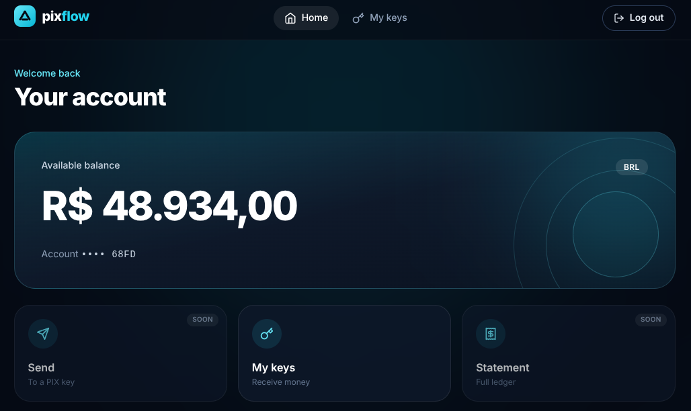
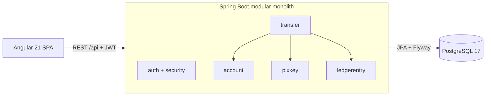

# PixFlow

A PIX-style instant payment platform: double-entry ledger, optimistic locking with retry, idempotent transfers, JWT auth. Ando also a portfolio project that helps me understand banking applications and how to handle concurrency. Messaging on the way!

    



## Why this is interesting

- **Double-entry Ledger:** Instead of saving all information into one single row, I have decided to split ledge entries into two: one for the debit and another for the credit. **Auditability and integrity** were the main reasons since it helps keeping history of transactions per account in case it is required to restore the balance at certain point.
- **Concurrency Safety:** Every account has a version column that helps preventing two different transfers to affect the same balance at once. Through optimistic locking we can prevent this behavior by incrementing the version column whenever a transfer is succesfully accomplished. By doing this, we are able to tell whether we are updating the actual balance or an old one. There is even a race test (@RepeatedTest(20)) to validate this functionality and make sure exactly one transfer wins.
- **Idempotent Transfers:** Sometimes it may occur that a user sends the same transfer/operation twice, be it due to network problems or UX problems. Either way, a unique constraint on (source_account_id and idempotency_key) make it easier to identify if the same request is coming twice. With that in mind, we are able to treat it correctly in the backend by identifying those duplicates. If its the same source account and key, it returns the original transfer, the same key with a different payload is rejected with 422.
- **Security:** Even though this is still in progress and quite common throughout applications, it is worth saying that this application uses JWT to ensure safety and also token expiration for damage control. On top of that, it uses BCrypt, UUIDs for users and also login and registration safeguards.
- **Test Coverage:** Also worth noticing that this application has several tests to facilitate deploys and future updates. I have plans on deploying a pipeline for it.

## Architecture

PixFlow is a **modular monolith**: one deployable Spring Boot application, split into feature modules (`account`, `auth`, `pixkey`, `transfer`, `ledgerentry`, `user`, `security`, `web`) that each own their entities, repositories, services and controllers (package-by-feature, not package-by-type). It avoids the operational cost of microservices while keeping module boundaries clean enough to split later. The reasoning is recorded in [ADR-0001](docs/adr/0001-modular-monolith.md).



A transfer runs inside one database transaction: it resolves the target account from the PIX key, debits the source (guarded by the account `version`), credits the target, and writes the two ledger entries. A non-transactional retry wrapper re-runs the whole thing on optimistic-lock conflicts (up to 5 attempts). See [ADR-0002](docs/adr/0002-optimistic-locking.md).

## Tech stack

| Layer    | Technology                                                                 |
| -------- | -------------------------------------------------------------------------- |
| Backend  | Java 21, Spring Boot 4.1, Spring Security (OAuth2 resource server / JWT), Spring Data JPA |
| Database | PostgreSQL 17, Flyway migrations (`ddl-auto=validate`)                      |
| Frontend | Angular 21 (standalone components, signals), Tailwind CSS v4                |
| Testing  | JUnit 5, Testcontainers (real PostgreSQL), Vitest                           |
| Infra    | Docker Compose (PostgreSQL, Spring Boot backend, nginx-served Angular build) |

## Quick start

### Option A: Docker (recommended)

Only Docker with Compose v2 is needed. This starts PostgreSQL, the backend and the frontend, and creates a demo user.

```bash
cd infra
cp .env.example .env
# put the output of this command after JWT_SECRET= in infra/.env
openssl rand -base64 48

docker compose up --build
```

Open `http://localhost:4200` and log in with the demo user:

| Email              | Password            |
| ------------------ | ------------------- |
| `ada@pixflow.demo` | `demo-password-123` |

The demo user has R$ 5,000.00 and three PIX keys (email, phone, CPF). The demo data is created by `DemoDataSeeder`, which only runs when `PIXFLOW_SEED_ENABLED=true` (set in the compose file) and is skipped if the user already exists.

To start again from an empty database, run `docker compose down -v`.

> The database credentials in the compose file (`pixflow`/`pixflow`) and the demo password are for local use only.

### Option B: Local development

Run the database in Docker and the backend and frontend on your machine, so changes reload without rebuilding images.

**Prerequisites:** Java 21, Node.js 22 and npm, Docker with Compose v2, and Angular CLI 21 (`npm install -g @angular/cli`, or use `npx ng`).

1. **Start the database only**

   ```bash
   docker compose -f infra/docker-compose.yml up -d postgres
   ```

2. **Configure the backend.** The app refuses to start without a JWT signing secret (at least 32 bytes).

   ```bash
   cd backend
   cp .env.example .env
   # put the output of this command after JWT_SECRET= in .env
   openssl rand -base64 48
   ```

3. **Start the backend** (from `backend/`, since it reads `.env` from the working directory). Flyway creates the schema on first start.

   ```bash
   ./mvnw spring-boot:run
   ```

   The API listens on `http://localhost:8080`.

4. **Start the frontend**

   ```bash
   cd frontend
   npm install
   npm start
   ```

   Open `http://localhost:4200`. The dev server proxies `/api` to the backend, so no CORS setup is needed. Register an account and log in.

> Note: restart `npm start` if you change `proxy.conf.json`; the proxy is only read at startup.

## API overview

Everything except register, login and `/actuator/health` requires `Authorization: Bearer <token>`. The caller's identity comes from the token, never from the request body, and other users' resources return `404`.

| Method | Path                    | Auth | Description                                              |
| ------ | ----------------------- | ---- | -------------------------------------------------------- |
| POST   | `/auth/register`        | No   | Create a user and its single account                     |
| POST   | `/auth/login`           | No   | Exchange credentials for a 15-minute JWT                 |
| GET    | `/accounts`             | Yes  | The caller's account (balance, currency)                 |
| GET    | `/accounts/{id}`        | Yes  | One account (only the caller's own)                      |
| GET    | `/accounts/{id}/ledger` | Yes  | Ledger entries for the account                           |
| DELETE | `/accounts/{id}`        | Yes  | Delete the account (rejected while in use)               |
| GET    | `/pixkeys`              | Yes  | The caller's PIX keys                                    |
| GET    | `/pixkeys/{id}`         | Yes  | One PIX key                                              |
| POST   | `/pixkeys`              | Yes  | Register a key (`EMAIL`, `PHONE` or `CPF`)               |
| DELETE | `/pixkeys/{id}`         | Yes  | Remove a key                                             |
| GET    | `/transfers`            | Yes  | The caller's transfers                                   |
| POST   | `/transfers`            | Yes  | Send money to a PIX key, with an idempotency key         |

Errors use RFC 7807 problem details: `400` validation, `404` not found, `422` business rule (insufficient balance, self-transfer, idempotency key reused with a different payload), `409` retries exhausted.

Quick demo with the seeded user. Register a second user and create a PIX key for it first, since sending to your own key is rejected:

```bash
# second user and a key to send to
curl -X POST localhost:8080/auth/register -H 'Content-Type: application/json' \
  -d '{"name":"Bruno","email":"bruno@pixflow.demo","password":"demo-password-123"}'
BRUNO=$(curl -s -X POST localhost:8080/auth/login -H 'Content-Type: application/json' \
  -d '{"email":"bruno@pixflow.demo","password":"demo-password-123"}' | jq -r .accessToken)
curl -X POST localhost:8080/pixkeys -H "Authorization: Bearer $BRUNO" -H 'Content-Type: application/json' \
  -d '{"keyValue":"bruno@pixflow.demo","keyType":"EMAIL"}'

# Ada sends R$ 50.00 to Bruno's key
ADA=$(curl -s -X POST localhost:8080/auth/login -H 'Content-Type: application/json' \
  -d '{"email":"ada@pixflow.demo","password":"demo-password-123"}' | jq -r .accessToken)
curl -X POST localhost:8080/transfers \
  -H "Authorization: Bearer $ADA" -H 'Content-Type: application/json' \
  -d '{"pixKeyValue":"bruno@pixflow.demo","amount":50.00,"idempotencyKey":"3f6c1a52-0000-4000-8000-000000000001"}'
```

## Tests

```bash
cd backend && ./mvnw clean verify     # 144 tests
cd frontend && npx ng test --watch=false   # 29 tests
```

Backend tests run against a real PostgreSQL 17 started by Testcontainers (Docker must be running), so Flyway migrations are exercised for real. They cover:

- repositories and entity rules (`@DataJpaTest`)
- the transfer service, including concurrent transfers (`@RepeatedTest(20)` race tests proving one winner and one loser, and that the retry wrapper makes both succeed)
- controllers and error mapping
- the full auth flow, including forged, expired and wrong-secret tokens and access to other users' resources

Use `clean` when verifying: stale IDE-compiled classes in `target/` can hide compile errors.

## Documentation

- [ADR-0001: Modular monolith over microservices](docs/adr/0001-modular-monolith.md)
- [ADR-0002: Optimistic locking for account balances](docs/adr/0002-optimistic-locking.md)
- [Known gaps and technical debt](docs/known-gaps.md): a prioritized, honest list of what is missing

## Project status & roadmap

**Done**
- Users, accounts (one per user), PIX keys
- Transfers with double-entry ledger, optimistic locking with bounded retry, idempotency
- JWT authentication and per-user authorization
- Frontend: login, register, dashboard (balance and recent activity)

**In progress**
- Frontend: PIX keys management

**Planned**
- Frontend: send money, statement (ledger) page
- CI pipeline (GitHub Actions)
- Refresh tokens and login rate limiting
- Kafka (events for completed transfers) and Redis (rate limiting), only where there is a concrete reason

See [known gaps](docs/known-gaps.md) for the full list.

## License

MIT. See [LICENSE](LICENSE).
